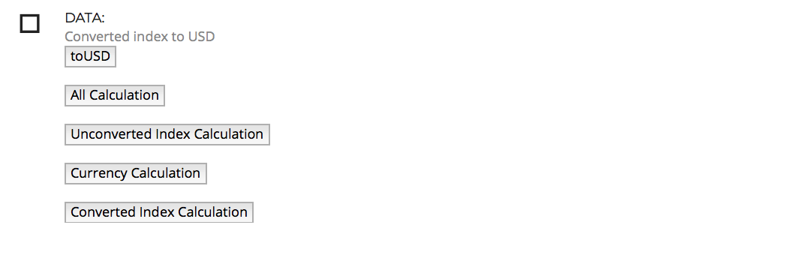
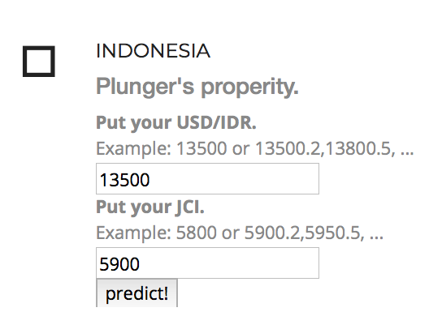
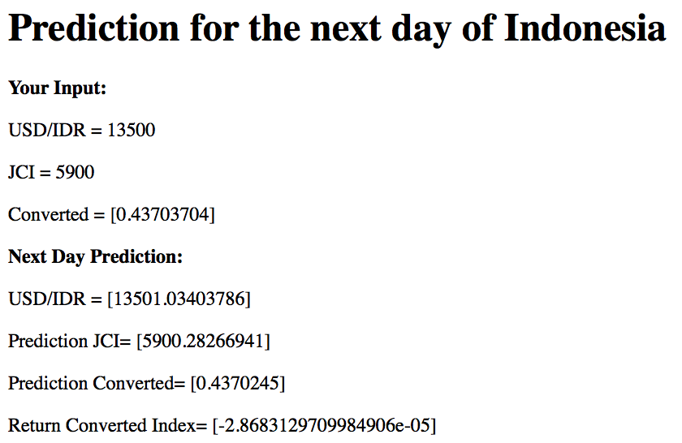
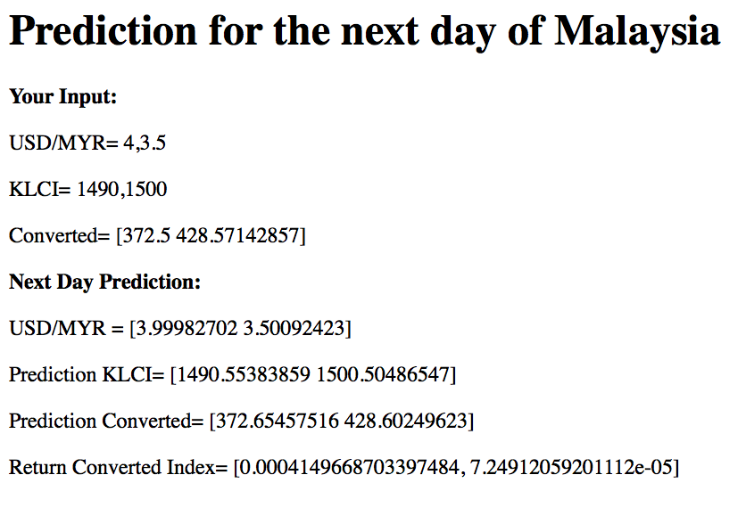

# Final Project | Flock's Index

## By: Satrio Pangestu | JCDS07  
__Dataset__: Capital Market Index in ASEAN and the currency USD to the currency of ASEAN countries.  
__Data Source__: [tradingeconomics](https://www.tradingeconomics.com/).
Data that I use are the USD to the currency of the destination country and Capital Market Index of countries in ASEAN period 2014 - 2019.
 

## PROJECT DESCRIPTION
The purpose of this application is to give a prediction and an insight for traders or investors that use US Dollar for their investment in ASEAN capital market.  
The prediction in this apps is on daily basis. Thus, if you're a trader, you can make your techical prediction for the next day closing price of your US dollar to the currency of destination country and the country's capital market index based on the previous day closing price with ceteris paribus assumption. 
However, if you are an investor you can make your decision precisely with deliberations of risk, return, and the most appropriate thing, sharpe ratio. 
All those things you can get in here. Whether you are a trader, an investor, or both that use the uncle sam currency, surely you will get a lot of insight to your investment decision from this apps. 

## APPS
## Front Page:
On The Front Page 
You can see: 

## Comparison for investment guidance:
Calculation of Data for Consideration:

You can get the standard deviation, the total return, the periodic mean return, and the sharpe ratio.
Noticing the largest Sharpe Ratio of index is the best for the investment decision. The one that has the largest sharpe ratio is mean that the index gives you the best return compare to its risk(return standard deviation).

## Prediction:
Guidance to Predict:
1. Write your currency and index:

2. Click predict!

## Prediction Result:

 

Hopefully you can get many insight from this project for your investment decision.
Thank you.
